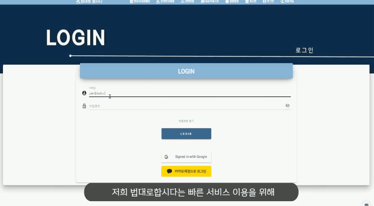

# ⚖️法대로 합시다

> 국민이 가장 많이 필요로 하는 생활법령을 쉽게 찾아주는 서비스

# 🛠️제공기능

## 🔨설치

Linux 환경에서 Jenkins 설치 후, Jenkinsfile을 Groovy 플러그인에 스크립트로 로드, 등록하여, 

해당 프로젝트를 빌드처리 하시기 바랍니다!

## 📜 개발 일정

## 🔍기술스택

# 💯팀원소개

# :dev개발 변경사항

Feb 9, 2021 : 찬반논쟁 기능 수정

Feb 9, 2021 : 생활법령 기능 추가

Feb 8, 2021 : 채팅 기능 추가

Feb 8, 2021 : 변호사 회원가입 정보 일부 삭제, OCR 관련 기능 추가 예정

Feb 7, 2021 : 게시판(삭제, 수정), 회원탈퇴, 회원정보수정 , 자문매칭(삭제,수정) + 자문매칭 테이블 추가

Feb 5, 2021 : 비밀번호 변경, 임시 비밀번호 발급 추가

Feb 4, 2021 : 찬반논쟁 일부 추가

Feb 4, 2021 : 프로필 사진 수정/조회 추가, 재문매칭 추가

Feb 3, 2021 : 이미지 업로드/다운로드 기능 추가

Feb 3, 2021 : 판례검색, 판례번호조회, 검색어순위TOP10조회 추가

Feb 1, 2021 : 테이블 컬럼 일부 변경에 따른 데이터 수정
                         "lawyer" photo → "member" image
                         현재는 재역할을 수행하지 않으나, 차후 작업 시 반영 예정

## Meta

SSAFY 4th PERFECT TEAM. – whxorb44@gmail.com

Distributed under the MIT license. See `LICENSE` for more information.

[https://lab.ssafy.com/s04-webmobile1-sub2/s04p12d103](https://github.com/s04p12d103/)

## 참여

1. Fork it ([https://lab.ssafy.com/s04-webmobile1-sub2/s04p12d103/fork](https://lab.ssafy.com/s04-webmobile1-sub2/s04p12d103/fork))
2. Create your feature branch (`git checkout -b feature/fooBar`)
3. Commit your changes (`git commit -am 'Add some fooBar'`)
4. Push to the branch (`git push origin feature/fooBar`)
5. Create a new Pull Request

[pjt-logo] : https://lab.ssafy.com/s04-webmobile1-sub2/s04p12d103/images/logo.png [wiki]: https://lab.ssafy.com/s04-webmobile1-sub2/s04p12d103/wiki